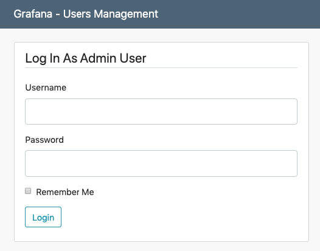
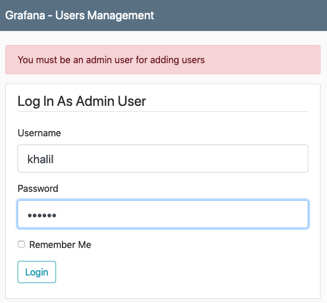
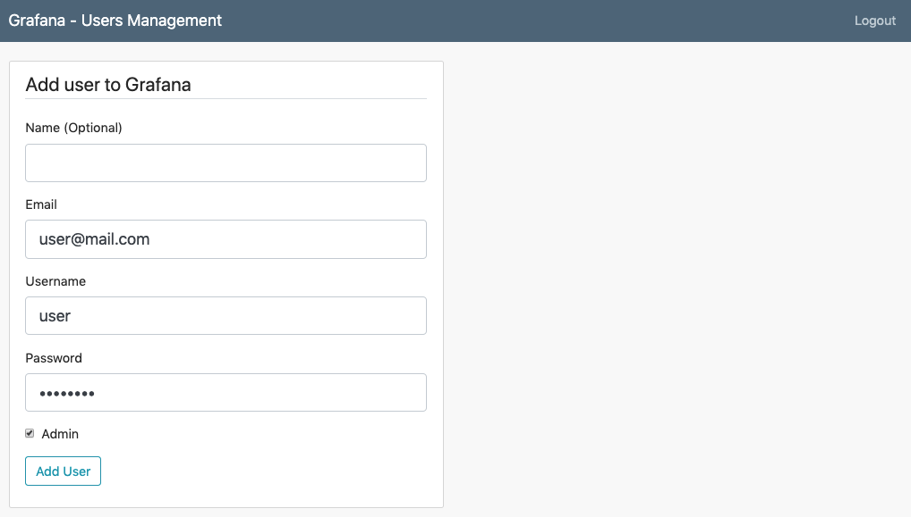
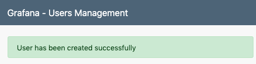
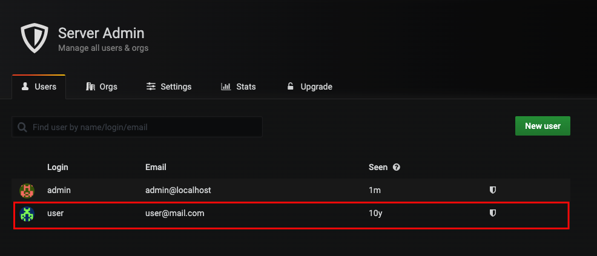

# Granafa Users Management

### Description:
- A Flask python application for adding users to Grafana service.

    
- Login is restricted only for Grafana admin users.

    
    
- You can add regular or admin users.
    
    
    
    
    
    
    

### Build and push the image
- ```docker build -t khjomaa/grafana-users:1.0.0 ./grafana-users/```
- ```docker push khjomaa/grafana-users:1.0.0```
- Run locally:
    ```
    docker run -d -p 5000:5000 \
    -e SECRET_KEY=<Your Secret Key> \
    -e GRAFANA_HOST=<Grafana service URL> \
    khjomaa/grafana-users:1.0.0
    ``` 
    
    For example:
    ```
    docker run -d -p 5000:5000 \
    -e SECRET_KEY=mysecret \
    -e GRAFANA_HOST=http://192.168.99.174:32688 \
    khjomaa/grafana-users:1.0.0
    ```


### Needed Helm Chart Values
| Parameter | Description | Default
| --- | --- | ---
| `grafana.host` | Grafane service URL | None


### Deploy the app
- ```helm upgrade --install <RELEASE NAME> ./helm/grafana-users```
- Follow the instruction on the output


### Clean
- ```helm delete <RELEASE NAME>```

<!--
- ```kill -9 $(ps -ef | grep port-forw | grep svc/app-grafana-users | awk '{print $2}')```
-->