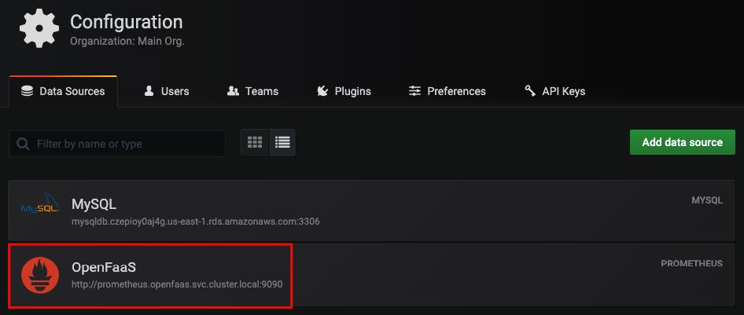

### Task
Add OpenFaaS prometheus as datasource to grafana

#### Prerequisites
- Add RDS MySQL credentials in file **datasource.yml**
```yaml
...     
url: <endpoint>:3306
password: <RDS MySQL Password>
user: <RDS MySQL User>
database: <RDS MySQL Database Name>
```

#### NOTES:
- Added to file **datasources.yml** the Prometheus server in **openfaas** namespace
```yaml
- name: OpenFaaS
  type: prometheus
  access: proxy
  orgId: 1
  url: http://prometheus.openfaas.svc.cluster.local:9090
  # allow users to edit datasources from the UI.
  editable: true
```




