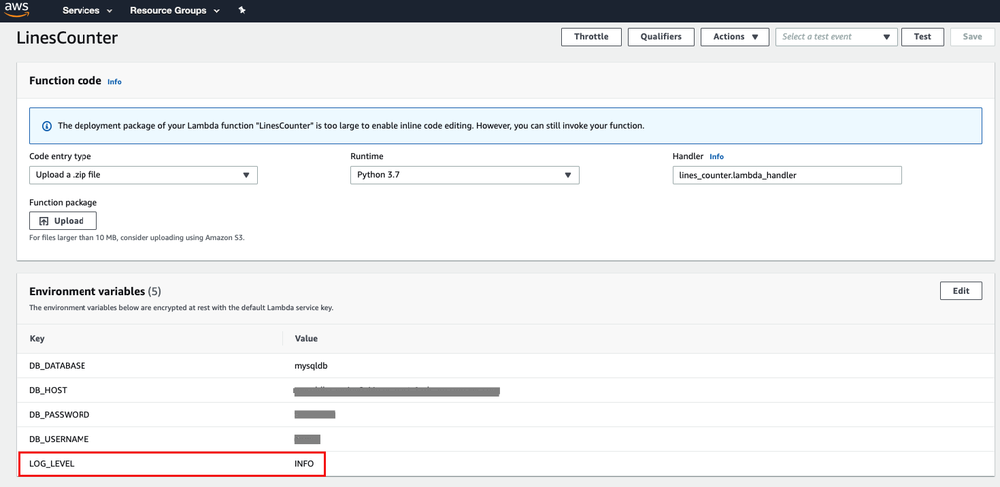

### IMPORTANT
The code in lines_counter function is based on an environment variables of RDS MySQL credentials.
Make sure to set those variables in the **main.tf** file 

### Create zip folder
1. ```pip install -r requirements.txt -t .```
2. ```zip -r9 ./lines_counter.zip * -x "./bin/*" requirements.txt```

### Deploy AWS Lambda Function:
1. ```terrafrom init```
2. ```terrafrom plan``` 
3. ```terrafrom apply --auto-approve```
 
### Clean:
- ```terraform destroy --auto-approve```

### NOTES 
- The zip command zipping all files and folders except **bin** folder (not needed)
- In case you want to exclude more files or folders, then just add them to the command (see example below)

    ```zip -r9 ./lines_counter.zip * -x "./bin/*" requirements.txt *terraform*```
- Update the zip file in case you made changes to code only:

    ```zip -g ./lines_counter.zip lines_counter.py```
- The log level of the code was set to **INFO** as default. 
In case you have an issue in the code and want to debug, just change the value in the lambda function to **DEBUG**



