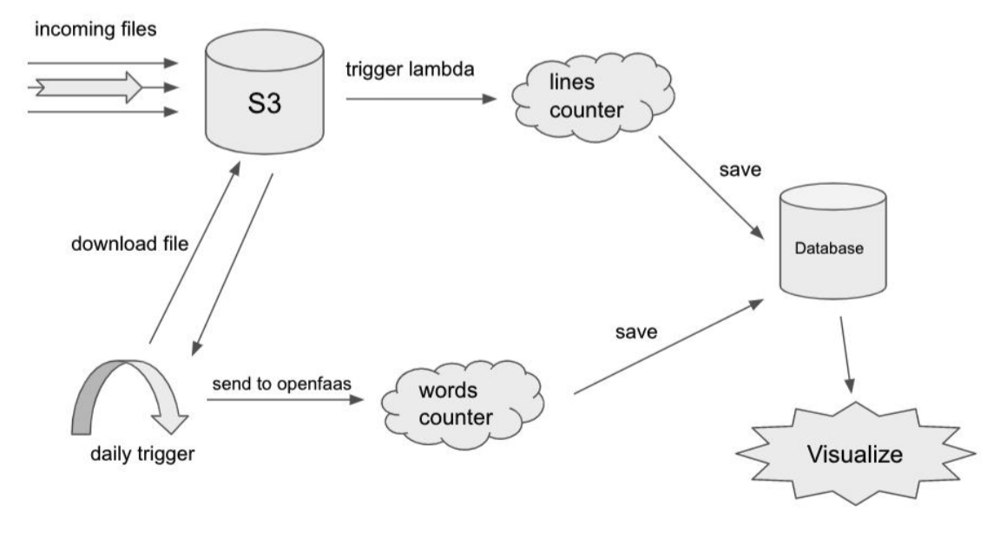

# Architecture Project

This project goal is to practice and deploy a system which is combined from different
components assembled to serve a system made with event driven and microservices
architectures.

### About the project
in this project we will deploy the following parts:
1. MySQL RDS - we will use the MySQL RDS to store all of our application data, that is
files path in S3 bucket, their amount of lines and their amount of words in each one of
them.
2. Lines Counter - An event driven system that counts the amount of lines in an S3 bucket
objects into a MySQL RDS table.
3. Words Counter - A FaaS application that upon an input will return the amount of words
given.
4. Words Counter Batch - A service that runs once a day, takes all of the files in an S3
bucket, counts the amount of their words using the “Words Counter” and saves the
information to MySQL RDS database.
5. Visualization Service - A Grafana application configured with MySQL as a datasource to
visualize different charts in the project’s database.

### System Overview



### Understanding the Project’s components

#### MySQL Database

The MySQL RDS will be made from two tables with the following structure:
- Lines
    1. ID - a UUID string for a given file
    2. ObjectPath - A string showing the path of the file in S3
    3. Date - String showing the time and date the file to the database
    4. AmountOfLines - integer field describing the amount of lines in a given file
- Words
    1. ObjectPath - A string showing the path of the file in S3
    2. Date - String showing the time and date the file to the database
    3. AmountOfWords - integer field describing the amount of words in a given file

#### Lines Counter
The lines counter is an application that is made of an AWS Lambda written in python which it’s purpose is upon a new file event in S3 bucket it will download that file, count it’s lines and save it’s amount of lines into a MySQL RDS table called “Lines”.

A deployment of an example lines counter can be found at:

https://github.com/avielb/advanced-devops/tree/master/serverless/terraform/projects/lines_counter
#### Words Counter

The words counter is an OpenFaaS function that we deploy. the function input is a string originated from an S3 object contents, the function will return the amount of words in that string.

Example for such a function can be found here:

https://github.com/avielb/advanced-devops/blob/master/serverless/openfaas/word-counter.yaml

#### Words Counter Batch
The words counter batch is a python application scheduled to run once a day in kubernetes cluster.
Everytime the application is running it will do following:
1. It will get all of the files added in the past 24 hours to an AWS S3 bucket
2. for each file it will download the file from S3
    - send it’s content to the words counter.
    - save the amount of words to a MySQL table called “Words”.

Code of the words counter batch can look in form of:
```python
from datetime import datetime, timedelta
from dateutil.tz import tzutc, UTC
import boto3
s3 = boto3.resource('s3', region_name='YOUR-REGION')
bucket = s3.Bucket('YOUR-BUCKET')
for object in bucket.objects.all():
    if object.last_modified > datetime.now(tzutc()) - timedelta(hours = 24):
        <download the file>
        <send it to words counter in openfaas>
        <save to database>
```

An example of how to schedule workload periodically in kubernetes can be found here:

https://kubernetes.io/docs/concepts/workloads/controllers/cron-jobs/

#### Visualization Service
The visualization service is a grafana application which is connected to our MySQL RDS and we will use it in order to visualize the following charts:
1. Amount of files added per week.
2. Top 5 files table with largest amount of lines.
3. Top 5 files table with largest amount of words.

### Project Solution
The project solution should be constructed as a git repository with the following folders:
1. DATABASE - this folder should contain terraform files and modules for creating our RDS MySQL database, the folder should also maintain the .sql scripts for creating the database tables.
2. LINES_COUNTER - this folder will consist any terraform files used to create and deploy anything related to the lines counter application (S3 bucket, lambda, python code, firewall definitions and more) 
3. WORDS_COUNTER - in this folder we will have anything related to the words counter OpenFaaS application that is its function yaml(s), code or anything else.
4. WORDS_COUNTER_BATCH - this directory will be contain the following assets:
    - Python code for downloading, sending to OpenFaaS and saving results to the database for each S3 object.
    - A helm chart for deploying the Words Counter Batch application to kubernetes.
5. VISUALIZATION_SERVICE - in this directory we will store anything related to the visualization service, things as follows:
    - values.yaml for the deploying grafana
    - configmap for configuring grafana with our MySQL RDS
    - json files for our charts and dashboards

### Project Bonuses
1. Add a user management service by adding users to the grafana service
2. Add OpenFaaS prometheus as datasource to grafana
3. Change code to limit all files to 3KB
4. Deploy AWS ElasticSearch and change “Words Counter Batch” to save the file content as an ElasticSearch document.
5. Configure ElasticSearch as grafana datasource
6. Use grafana to search and monitor our ElasticSearch following this guide:

    https://grafana.com/docs/grafana/latest/features/datasources/elasticsearch/
