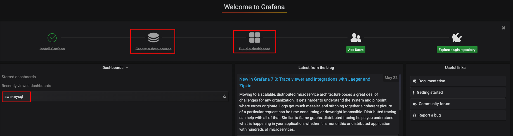
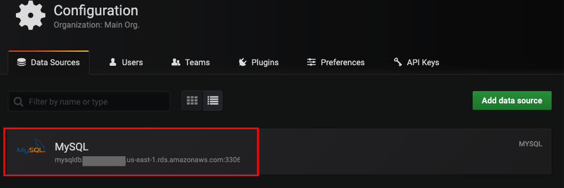
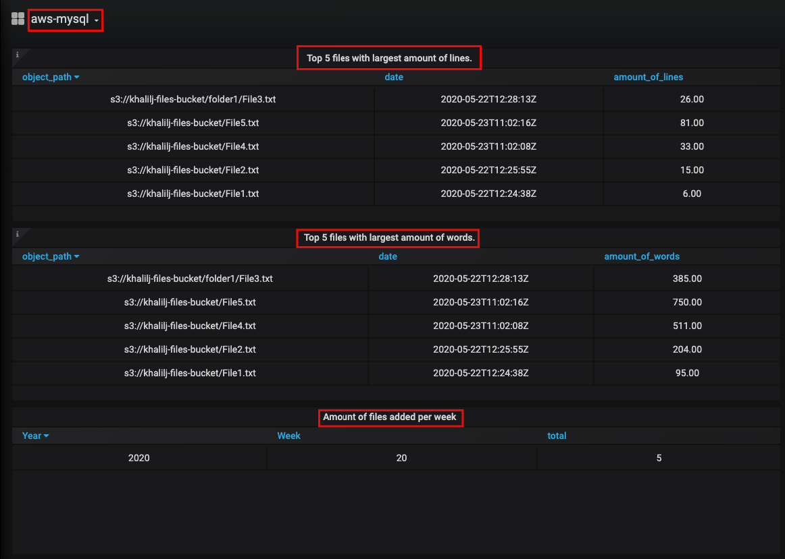

#### Prerequisites
- Add RDS MySQL credentials in file **datasource.yml**
```yaml
...     
url: <endpoint>:3306
password: <RDS MySQL Password>
user: <RDS MySQL User>
database: <RDS MySQL Database Name>
```

#### Deploy Grafana:
- ```kubectl apply -f namespace.yml```
- ```kubectl apply -f grafana/datasources.yml```
- ```kubectl apply -f grafana/dashboards.yml```
- ```kubectl -n monitoring get configmaps```
- ```helm upgrade --install grafana -n monitoring stable/grafana -f grafana/values.yaml```
- Wait until Grafana pod is running and ready (```kubectl -n monitoring get pods```)
- Get Grafana URL:
    - ```minikube service grafana --url -n monitoring```
- Browse to URL from previous step
- Enter credentials (User: **admin**, Password: **admin123**)








<!--
#### Opening a shell when a Pod has more than one Container
- ```kubectl describe pod/grafana-5b7db84545-5jmcc -n monitoring```
- ```kubectl -n monitoring exec -it grafana-5b7db84545-5jmcc --container grafana sh```
-->

#### Clean:
- ```kill -9 $(ps -ef | grep port-forward | grep 3000 | awk '{print $2}')```
- ```helm -n monitoring delete grafana```
- ```kubectl -n monitoring delete cm --all```
- ```kubectl delete ns monitoring```

