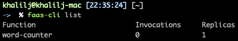
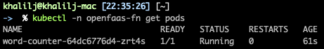

### [Deploy OpenFaaS using Helm](https://github.com/openfaas/faas-netes/blob/master/chart/openfaas/README.md)
1. **Start minikube**
    - ```minikube start --cpus 2 --memory 6144 --vm-driver virtualbox```
2. **Deploy OpenFaaS using Helm**
    - Create namespaces
        - ```kubectl apply -f https://raw.githubusercontent.com/openfaas/faas-netes/master/namespaces.yml```
    - Add OpenFaaS repo to Helm
        - ```helm repo add openfaas https://openfaas.github.io/faas-netes/```
    - Update repo
        - ```helm repo update```
    - Generate basic-auth secret
        ```
        kubectl -n openfaas create secret generic basic-auth \
        --from-literal=basic-auth-user=admin \
        --from-literal=basic-auth-password="123456"
        ```
    - Deploy chart
        ```
        helm upgrade openfaas --install openfaas/openfaas \
        --namespace openfaas \
        --set functionNamespace=openfaas-fn \
        --set generateBasicAuth=false
        ```
    - Wait until OpenFaaS pods are in status running and ready (```kubectl -n openfaas get pods```)
    - Forward the port for gateway service
        - ```kubectl port-forward svc/gateway -n openfaas 8080:8080 &```
    - [Install faas-cli](https://github.com/openfaas/faas-cli)
        - Download and install
            - Linux and OSX:
                - ```curl -sSL https://cli.openfaas.com | sudo sh```
            - Windows users:
                - Go to: https://github.com/openfaas/faas-cli/releases
                - Download the latest faas-cli.exe
                - Move it under: C:\windows\System32
        - login
            - ```export OPENFAAS_URL=http://localhost:8080```
            - ```echo -n 123456 | faas-cli login --password-stdin```
    
**NOTE:** If you want to open OpenFaaS UI follow the following steps:
- Open browser and navigate to http://localhost:8080 or http://127.0.0.1:8080
- Login (User: **admin**, Password: **123456**)
- In case **faas-cli login** command failed try to run the export command again with http://127.0.0.1:8080


### Deploy word-counter function
1. Install the function
    - Open Terminal
    - navigate to WORDS_COUNTER folder
    - ```faas-cli deploy -f ./word-counter.yaml```
2. Verify
    - ```faas-cli list```
    
        
    - ```kubectl -n openfaas-fn get pods```
    
        

### Clean
- ```faas-cli remove word-counter```
- ```kill -9 $(ps -ef | grep port-forw | grep svc/gateway | awk '{print $2}')```
- ```helm -n openfaas delete openfaas```
- ```kubectl -n openfaas delete secrets basic-auth```
- ```kubectl delete ns openfaas openfaas-fn```
- ```helm repo remove openfaas```
- ```helm repo update```